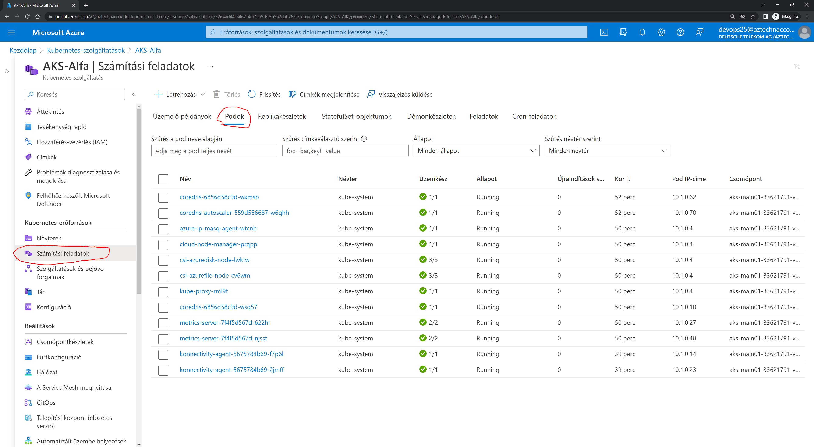
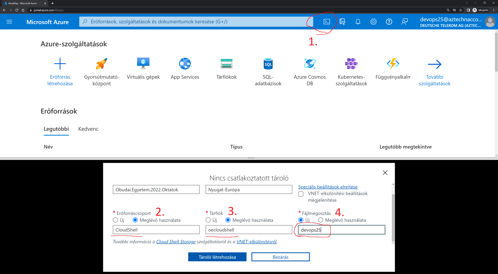
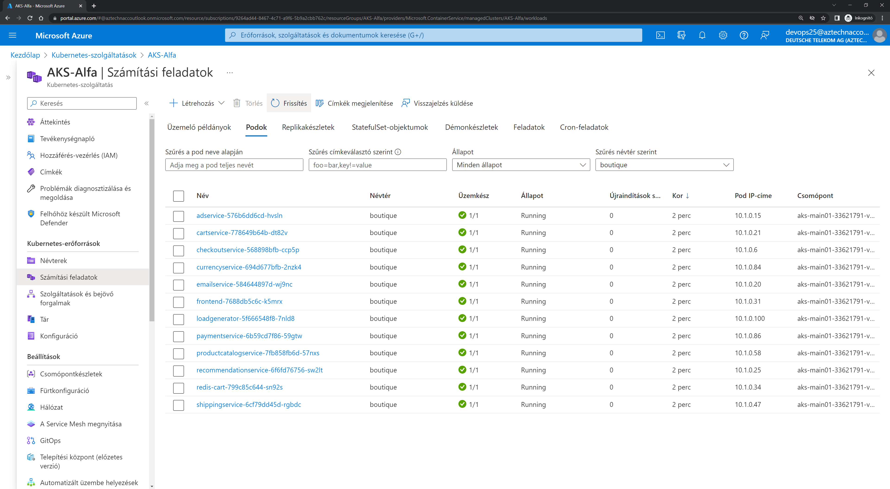
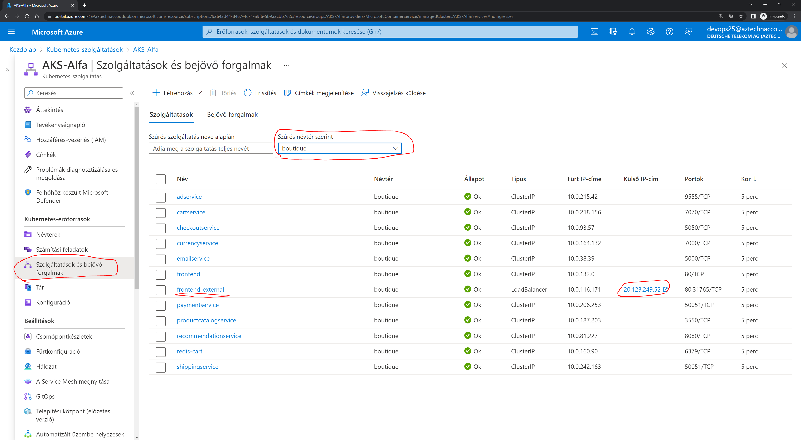

# Bevezető
Ezen a gyakorlaton a microservice-ekkel ismerkedünk meg. A Google microservice-es példáját fogjuk deploy-olni egy-egy Azure Kubernetes Services (AKS) cluster-en.

4 fős csapatokban dolgozunk, hasonlóan, egy DevOps team-hez. A csapattagok részeket/funkciókat kapnak a teljes alkalmazásból, amelyeket deploy-olni kell az AKS cluster-en, majd megvizsgálni a futását.

## A Google példa alkalmazása
Az eredeti alkalmazás és a dokumentációja ezen a linken érhető el: https://github.com/GoogleCloudPlatform/microservices-demo

Az alkalmazás egy online webshop-ot valósít meg, melynek a funkcióit feldarabolták microservice-ekre és ezek különböző programozási nyelveken kerültek implementálásra. További részletek az eredeti oldalon: https://github.com/GoogleCloudPlatform/microservices-demo#architecture

[](./img/architecture-diagram.png)

A futtatáshoz szükséges Kubernetes manifest file-ok nem az eredeti, hanem ebből a repo-ból érhetőek el a [/manifests](/manifests) könyvtárból.

## Környezet
A gyakorlathoz Azure környezetet fogunk használni és 4 fős csoportokban dolgozunk. Minden csoport kap 1-1 AKS cluster-t, amit használhat a futtatáshoz. A gyakorlat során minden résztvevő belép a saját cluster-ére és elindítja a részére kiadott microservice-eket. Ha minden container fut, akkor megnyitjuk a frontend által adott weboldalt és leellenőrizzük az eredményt.

# Feladatok
## Cluster és microservice szétosztás

| Hallgató   | Cluster     | Microservice-ek                                      |
|------------|-------------|------------------------------------------------------|
| devops01   | AKS-Alfa    | frontend, cartservice, productcatalogservice         |
| devops02   | AKS-Alfa    | currencyservice, paymentservice, shippingservice     |
| devops03   | AKS-Alfa    | emailservice, checkoutservice, recommendationservice |
| devops04   | AKS-Alfa    | namespace, adservice, redis                          |
|            |             |                                                      |
| devops05   | AKS-Bravo   | frontend, cartservice, productcatalogservice         |
| devops06   | AKS-Bravo   | currencyservice, paymentservice, shippingservice     |
| devops07   | AKS-Bravo   | emailservice, checkoutservice, recommendationservice |
| devops08   | AKS-Bravo   | namespace, adservice, redis                          |
|            |             |                                                      |
| devops09   | AKS-Charlie | frontend, cartservice, productcatalogservice         |
| devops10   | AKS-Charlie | currencyservice, paymentservice, shippingservice     |
| devops11   | AKS-Charlie | emailservice, checkoutservice, recommendationservice |
| devops12   | AKS-Charlie | namespace, adservice, redis                          |
|            |             |                                                      |
| devops13   | AKS-Delta   | frontend, cartservice, productcatalogservice         |
| devops14   | AKS-Delta   | currencyservice, paymentservice, shippingservice     |
| devops15   | AKS-Delta   | emailservice, checkoutservice, recommendationservice |
| devops16   | AKS-Delta   | namespace, adservice, redis                          |
|            |             |                                                      |
| devops17   | AKS-Echo    | frontend, cartservice, productcatalogservice         |
| devops18   | AKS-Echo    | currencyservice, paymentservice, shippingservice     |
| devops19   | AKS-Echo    | emailservice, checkoutservice, recommendationservice |
| devops20   | AKS-Echo    | namespace, adservice, redis                          |
|            |             |                                                      |
| devops21   | AKS-Foxtrot | frontend, cartservice, productcatalogservice         |
| devops22   | AKS-Foxtrot | currencyservice, paymentservice, shippingservice     |
| devops23   | AKS-Foxtrot | emailservice, checkoutservice, recommendationservice |
| devops24   | AKS-Foxtrot | namespace, adservice, redis                          |


## Belépés

Böngészőben nyisd meg az Azure Portal-t: https://portal.azure.com/

Belépéshez használd az egyik devops user-t, ami az órán kerül kiosztásra.
Ilyen formátumban add meg:
```
devops25@aztechnaccoutlook.onmicrosoft.com
```

A felhasználóhoz tartozó jelszó szintén az órán kerül kiosztásra.

## Ismerkedés a felülettel
Belépés után találunk néhány Erőforráscsoportot (Resource Group), melyekben fut az előre elkészített Kubernetes cluster. Mindenki keresse meg a hozzárendelt cluster-t.

Az AKS clusterre kattintva látható, hogy milyen alkalmazások futnak jelenleg rajta. Jelenleg a rendszer alapfutásához szükséges programok futnak csak.

[](./img/AKS_workload.png)

## Cloud shell megnyitása
Ahhoz, hogy új container-eket hozhassunk létre, csatlakoznunk kell az AKS cluster-hez. A portálon a jobb felső sarkában található egy konzol ikon, ami előhív egy webes konzolt.

Lépések:
1. Kattints a konzol ikonra a jobb felső sarokban. Alul megjelenik egy új panel.
   * Válaszd a Bash-t
   * Válaszd majd a "Speciális beállítások megjelenítését"
2. Az Erőforráscsoportnál (Resource Group) válaszd a "Meglévőt" és válaszd ki a **"CloudShell"**-t
3. A Tárfióknál (Storage Account) válaszd szintén a "Meglévőt" és válaszd ki a **"oecloudshell"**-t
4. A Filemegosztásnál (FileShare) válaszd az újat és add meg a neved vagy a felhasználóneved.
5. Végül a "Tároló létrehozása" gombbal létrejön a saját könyvtárunk és elindul a konzol.

[](./img/portal_console.png)

## Manifest-ek letöltése
A szükséges file-ok ebben a git repository-ban vannak, így ezeket le kell töltenünk a consolba a következő paranccsal:

```bash
git clone https://github.com/szasza576/oe-microservice.git
```

Amint letöltődtek a fájlok lépjünk be a könyvtárba:
```bash
cd oe-microservice/manifests/
```

## Belépés a Kubernetes-be
Ahhoz, hogy Kubernetes-ben létre tudjunk hozni alkalmazásokat, először be kell lépjünk a cluster-be. Ezt a következő paranccsal tehetjük meg.

FONTOS!!! Mindenki a saját cluster-ének a nevét adja meg!
```bash
az aks get-credentials --resource-group AKS-Alfa --name AKS-Alfa
```

## Alkalmazás deployment
Legelőször egy namespace-t kell létrehoznunk a Kubernetes-ben, amibe majd a többi alkalmazást létrehozhatjuk.

A csapatok 4. tagjaihoz tartozik a namespace, ezért ők a következő paranccsal létre tudják hozni azt:
```bash
kubectl apply -f namespace.yaml
```

Munkánkat leellenőrizhetjük a következő paranccsal:
```bash
kubectl get namespace
```

Ha a namespace elkészült, akkor a csapattagok elkezdhetik létrehozni a hozzájuk rendelt alkalmazásdarabokat.
```bash
kubectl apply -f <ALKALMAZÁSNÉV>.yaml
```

Az alkalmazás létrehozását nyomon követhetjük az AKS cluster oldalán.

[](./img/Boutique_deployed.png)

Vagy lekérhetjük a következő paranccsal a konzolból:
```bash
kubectl get pods -n boutique
```

## Alkalmazás elérése
Az alkalmazás egyik komponensét (frontend) úgy tervezték, hogy az interneten elérhető legyen. Ezért a hozzá tartozó manifest file automatikusan létrehoz egy publikus IP-t. Ezt szintén az AKS cluster oldalán találhatjuk a "Szolgáltatások és bejövő forgalom" (Services and Ingresses) fülön belül a "Szolgáltatások" (Services) alatt. Érdemes lehet a "Névtér" (Namespace) szűrőt boutique-ra állítani. 

[](./img/external_IP.png)

...vagy használhatjuk a konzolt is:
```bash
kubectl get services -n boutique frontend-external
```

## Hiba szimulálás
Könnyen előfordulhat, hogy egy-egy microservice meghibásodik és nem lesz elérhető. Ezt legkönnyebben úgy tudjuk szimulálni, hogy kitörölünk egy-egy elemet.

Például a checkoutservice csak a vásárlás végén kerül meghívásra. Ha ezt kitöröljük, akkor működőképes marad az oldal, de nem tudunk semmit vásárolni.

Törlési parancs a konzolban:
```bash
kubectl delete -f checkoutservice.yaml
```

Újra létrehozáshoz:
```bash
kubectl apply -f checkoutservice.yaml
```

## Még több hiba :)
Mennyire működőképes az oldal, ha lelövitek a currencyservice-t?

Próbáljátok ki, hogy reagál az oldal különböző microservice-ek kitörlésére.

## Végső takarítás
Az alkalmazás összes komponense kitörlődik, ha letöröljük a namespace-t.

```bash
kubectl delete namespace boutique
```

Ellenőrzés:
```bash
kubectl get namespace

kubectl get pods --all-namespaces

kubectl get services --all-namespaces
```
